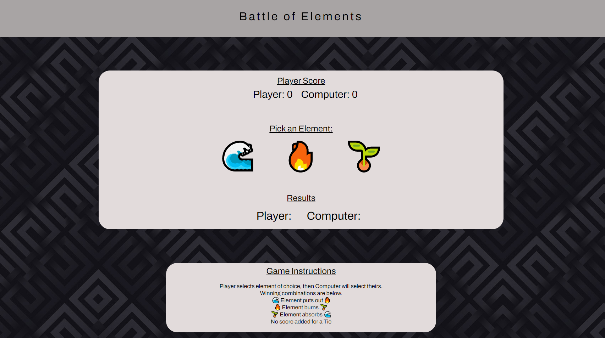

# Milestone Project 2

🖼️ 🎤 🎯 

## Battle of Elements (aka Rock Paper Scissors)

### 🖼️ Site Preview

#### Project Colors
As for colour scheme, I have decided to use a dark background of some kind, will upload some examples as I find them to try out and see which one I like as the page evolves. My thoughts are dark background with medium grey colored header and white title. The reason I have decided this color combination is to allow the game itself to be more enhanced on the page, game background will be white or off white, possibly light grey. 

#### Project Fonts
Researched fun fonts that look good in a game, couldn't find any that I liked. Searched through Google Fonts and decided on 'Archivo' font. I like the way it looks with bold rounded letters and I think it will look good for a game display font.

Table of contents:

1. Site Overview
2. Planning stage
   • Target Audiences
   • User Stories
   • Site Aims
   • Wireframes
   • Color Scheme
   • **Typography*
3. Current Features Common to all pages
   • Header Element:
   • The rest of your features
   • Footer
4. Individual Page Content features
   • About Page Content
   • Teachings Page Content
   • Community Page Content
   • Contact Page Content
   • Form Feedback Page Content
5. Future-Enhancements
6. Testing Phase
7. Deployment
8. Tech
9. Credits
   • Honourable mentions
   • General reference

#### Emojis from emojipedia.com
#### Background Image from thepatternlibrary.com

   • Content
   • Media  
